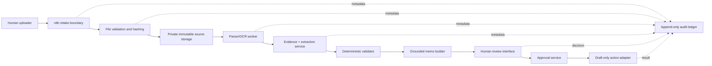
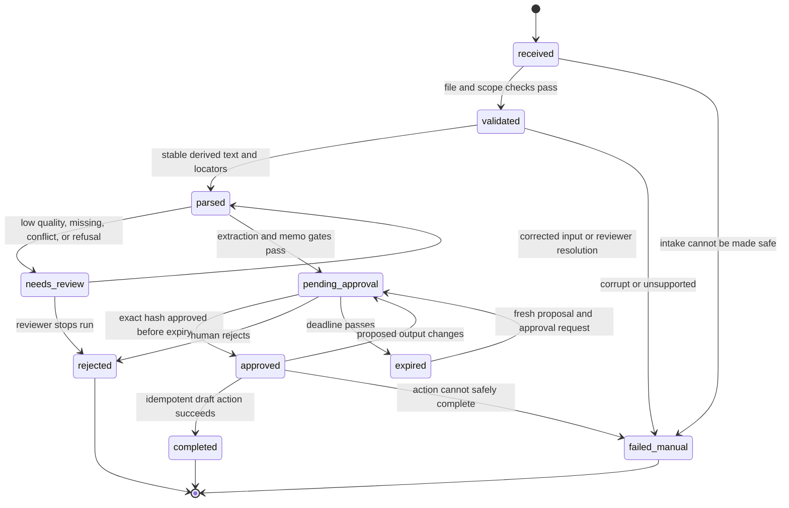

# Architecture, Contracts, and State

## Design objective

Build a system in which every transformation can be answered with:

1. Which exact source bytes entered?
2. Which parser, model, prompt, schema, and code version ran?
3. Which evidence supports each extracted or drafted fact?
4. Which deterministic checks passed or failed?
5. What exact output did a named human approve?
6. Which single action used that approval?
7. What safe state was reached if anything failed?

## Trust boundaries



Trust assumptions:

- uploaded documents, filenames, metadata, OCR text, and retrieved passages are untrusted;
- model output is untrusted until schema and semantic checks pass;
- n8n is an orchestrator, not the system of record;
- the database is the state authority;
- object storage contains immutable source bytes and separately versioned derivatives;
- the approval service—not the model or n8n canvas—authorizes an action;
- application audit rows are append-only; corrections are new events, not edits.

## Portable domain contracts

The normative machine-readable definitions live in [`schemas/contracts.schema.json`](schemas/contracts.schema.json). Pydantic models and database tables must preserve their meanings.

### `SourceDocument`

| Field | Meaning |
|---|---|
| `source_id` | Stable UUID generated before storage |
| `tenant_id` | Synthetic tenant boundary |
| `sha256` | Lowercase SHA-256 of exact received bytes |
| `original_filename` | Sanitised display filename; never a storage key by itself |
| `media_type`, `byte_size` | Validated file facts |
| `received_at` | UTC RFC 3339 time |
| `storage_uri` | Private, opaque source-object location |
| `parser_status` | `not_started`, `succeeded`, `partial`, or `failed` |
| `retention_class` | Policy key, not an arbitrary deletion date |

Uniqueness: `(tenant_id, sha256)` prevents duplicate ingestion from causing duplicate work. A duplicate attempt still creates an audit event.

### `EvidenceLocator`

| Field | Meaning |
|---|---|
| `source_id` | Exact immutable source |
| `chunk_id` | Stable ID derived from source, parser version, and sequence |
| `page` | One-based page number when meaningful |
| `bbox` | Optional `[left, top, right, bottom]` in a declared coordinate system |
| `char_start`, `char_end` | Optional span in canonical derived text |
| `supporting_text_hash` | SHA-256 of normalised supporting text |
| `quote` | Short display excerpt, not the evidence authority |

At least one usable locator method is required. A page number alone may be insufficient for dense tables; a character span alone may be unavailable for scans. Store the coordinate convention with parser metadata.

### `ExtractionRun`

Records the source, parser/model/prompt/schema/code versions, structured result, evidence links, deterministic validation results, status, timestamps, token use, cost estimate, and latency. Never overwrite a previous run when a prompt or model changes.

### `ApprovalDecision`

Records:

- the exact `proposed_output_sha256`;
- reviewer identity and tenant;
- `approved`, `edited`, or `rejected`;
- comments;
- UTC decision time;
- expiry;
- optional replacement output and its new hash.

`edited` means the original proposal is not approved. The edited version must be re-rendered, re-hashed, and explicitly approved as a new decision before action.

### `ActionExecution`

References one valid approval, one exact output hash, and one idempotency key. It records adapter, requested action, result, attempt count, timestamps, and safe error state. The capstone adapter creates only a local or connector draft; it cannot send.

### `AuditEvent`

Minimum fields:

- event UUID;
- trace ID and optional parent event ID;
- tenant and run ID;
- event type;
- actor type and actor ID;
- UTC timestamp;
- relevant code/parser/model/prompt/schema versions;
- redacted metadata;
- previous-event hash and event hash for tamper evidence.

Do not treat a database permission as a full append-only guarantee. Limit application roles to insert/select, restrict update/delete, and periodically export and hash the ledger.

## State machine

The database stores the current state; the audit ledger stores every transition.



### Allowed-state rule

Implement one transition function. It must:

1. lock the run row;
2. verify tenant, current state, and allowed transition;
3. verify prerequisites;
4. write the new state and audit event in one transaction;
5. reject duplicate or stale transition requests.

n8n asks for transitions through the API. It does not update state tables directly.

### Invariants

Test these independently of the model:

```text
I-01 Every run has exactly one current named state.
I-02 Every current state is reconstructable from ordered audit events.
I-03 A parsed source references the exact source hash it came from.
I-04 Every extracted fact references zero or more locators; required facts without one need review.
I-05 A memo assertion is either evidence-backed or visibly unsupported.
I-06 An approval is valid only for its tenant, run, output hash, reviewer authority, and time window.
I-07 Any output edit invalidates all approvals for the previous hash.
I-08 An action cannot start from pending, rejected, expired, or changed output.
I-09 One idempotency key cannot produce two completed actions.
I-10 Failure to persist the audit event prevents the corresponding action.
I-11 A duplicate source hash cannot cause a duplicate action.
I-12 The kill switch prevents new model calls and actions while preserving manual review.
```

## Evidence-aware extraction

The model returns values and candidate locator references. Your code verifies the references:

1. resolve the referenced chunk;
2. recompute the supporting text hash;
3. confirm the quoted support occurs in the chunk or indicated page region;
4. apply field-specific semantic checks;
5. mark invalid or ambiguous support as `needs_review`.

Confidence is not a fact and must not be accepted merely because the model emitted `0.98`. Prefer observable reasons such as `exact_label_match`, `cross_document_conflict`, `ocr_low_quality`, or `derived_calculation`.

## Deterministic versus probabilistic allocation

| Task | Mechanism |
|---|---|
| MIME/type/size checks, UUIDs, hashes | deterministic code |
| duplicate detection and idempotency | database constraint + code |
| PDF/DOCX parsing and OCR | parser/OCR, with quality checks |
| locating candidate commercial facts | model or rules |
| output shape | JSON Schema/Pydantic |
| VAT, totals, date arithmetic, thresholds | deterministic code |
| conflict comparison | deterministic comparison after normalisation |
| policy passage candidate retrieval | lexical/vector retrieval |
| policy applicability summary | model draft, evidence required |
| final memo wording | grounded model draft |
| supplier selection | outside system; human only |
| approval validity | deterministic code |
| action execution | deterministic adapter after approval |

## Model configuration contract

No model ID appears inside domain logic. Use environment or config:

```yaml
models:
  extraction: ${MODEL_EXTRACT}
  drafting: ${MODEL_DRAFT}
  embedding: ${MODEL_EMBED}
settings:
  response_store: false
  max_output_tokens: 4000
  reasoning_effort: low
```

For this dated edition, benchmark the current balanced and cost-efficient OpenAI models rather than permanently selecting one. [`stack-manifest.yaml`](stack-manifest.yaml) records the verified starting candidates. Pin a tested snapshot for a frozen release when the provider offers one; rerun the gold set before changing model, prompt, schema, parser, or retrieval configuration.

## Version tuple

Every extraction and memo must persist:

```text
(source_sha256,
 parser_name, parser_version, ocr_name, ocr_version,
 model_provider, model_id,
 prompt_id, prompt_sha256,
 schema_id, schema_sha256,
 code_commit,
 retrieval_config_sha256)
```

Without this tuple, a result cannot be reproduced or meaningfully compared.

